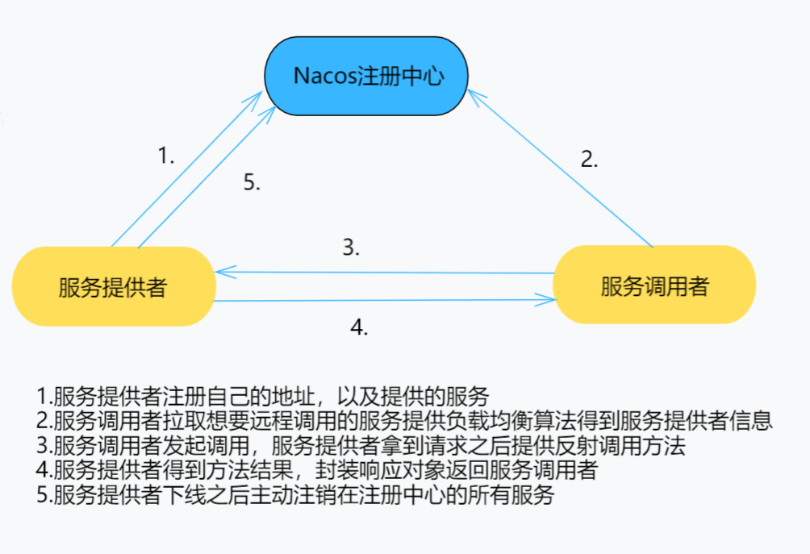

# Shy-RPC-Framework

## 简介

Shy-RPC-Framework 是一款基于Netty网络框架进行通讯，采用Nacos作为服务注册的RPC框架；提供了丰富的序列化方式：例如Kryo（默认）、JSON等。并且支持注册多个相同服务，同时为客户端的远程调用提供了轮询、随机等负载均衡算法。

## 架构



## 特点

* 基于Netty网络框架通讯

* 提供多种Netty通讯序列化算法：Kryo（默认），JSON

* 提供两种负载均衡算法：随机算法与轮转算法

* 采用Nacos作为服务的注册中心

* 实现自定义的通信协议：

  ```
  +---------------+---------------+-----------------+-------------+
  |  Magic Number |  Message Type | Serializer Type | Data Length |
  |    4 bytes    |    4 bytes    |     4 bytes     |   4 bytes   |
  +---------------+---------------+-----------------+-------------+
  |                          Data Bytes                           |
  |                   Length: ${Data Length}                      |
  +---------------------------------------------------------------+
  ```

  | 字段            | 解释                                                         |
  | :-------------- | :----------------------------------------------------------- |
  | Magic Number    | 魔数，表识一个协议包，0xABABABAB                             |
  | Message Type    | 包类型，标明这是一个调用请求还是调用响应                     |
  | Serializer Type | 序列化器类型，标明这个包的数据的序列化方式                   |
  | Data Length     | 数据字节的长度                                               |
  | Data Bytes      | 传输的对象，通常是一个`RpcRequest`或`RpcClient`对象，取决于`Package Type`字段，对象的序列化方式取决于`Serializer Type`字段 |

  

## 项目模块划分

- **rpc-api：**通用接口
- **rpc-common：**实体对象、工具类等公用类
- **rpc-core：**框架的核心实现
- **test-client：**测试用消费侧
- **test-server：**测试用提供侧

## 使用

* 在rpc-api定义通用的接口：

  ```java
  public interface UserService {
      User getById(int i);
  }
  ```

* 服务器端创建对应的实现类，并且使用@Service表示，以便将服务注册到注册中心

  ```java
  @Service
  public class UserServiceImpl implements UserService {
      @Override
      public User getById(int i) {
          return new User(1,"张三");
      }
  }
  ```

* 创建服务端模块：服务器端启动服务，使用@ServiceScan扫描指定包下所有服务，默认扫描启动类所在包及其子包

  ```java
  @ServiceScan
  public class TestServer {
      public static void main(String[] args) throws NacosException {
          RpcServer server = new NettyServer("127.0.0.1",8080);
          server.start();
      }
  }
  ```

* 服务器端启动，启动之前需要在本地8848端口启动Nacos服务，以确保服务顺利注册到注册中心

* 客户端提供代理，提供代理拿到想要调用的服务，调用服务的响应方法即可

  ```java
  public class TestClient {
      public static void main(String[] args) {
          RpcClient client = new NettyClient();
          RpcClientProxy proxy = new RpcClientProxy(client);
          UserService userService = proxy.getProxy(UserService.class);
          User user = userService.getById(1);
          System.out.println(user);
      }
  }
  ```

  